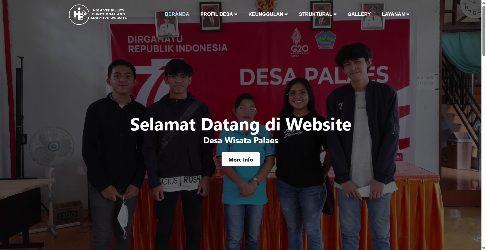
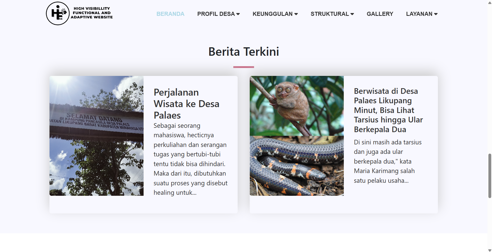
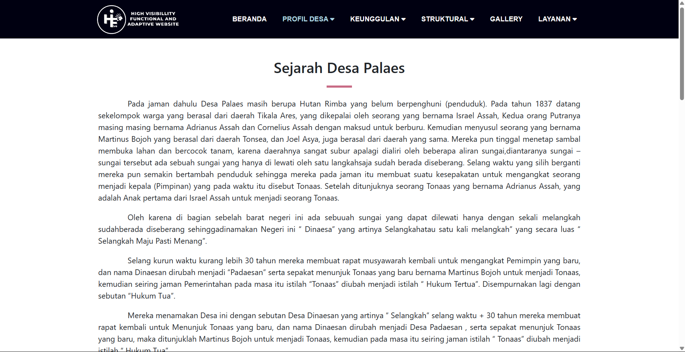
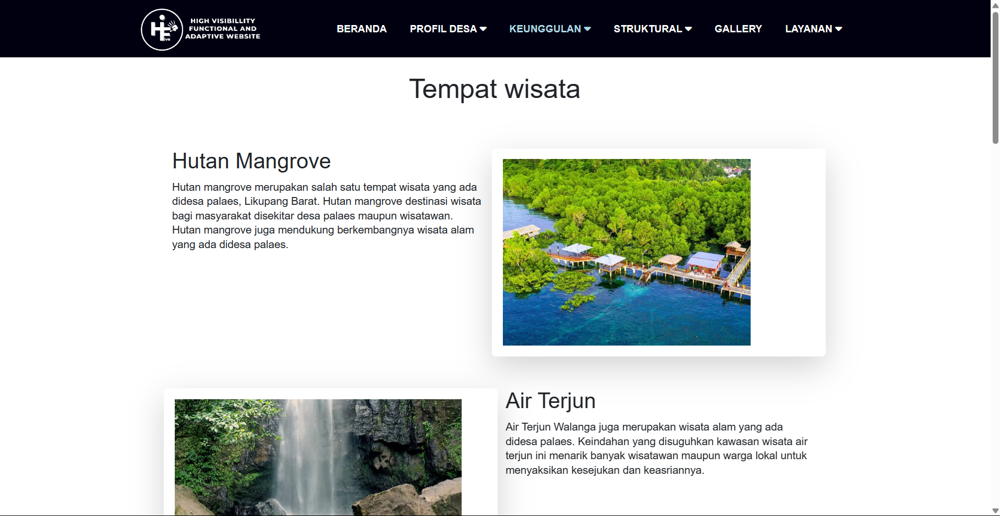
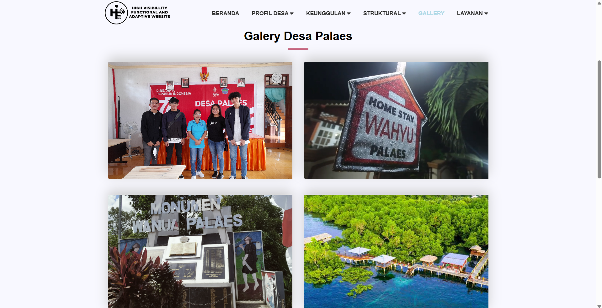
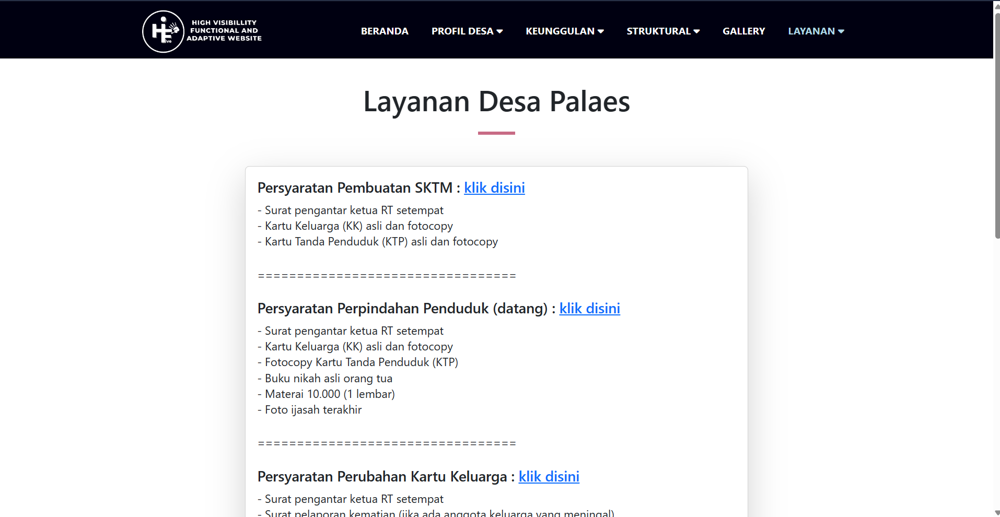
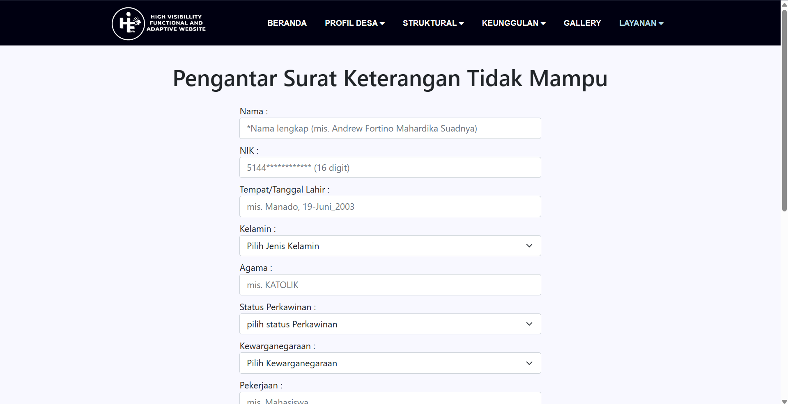
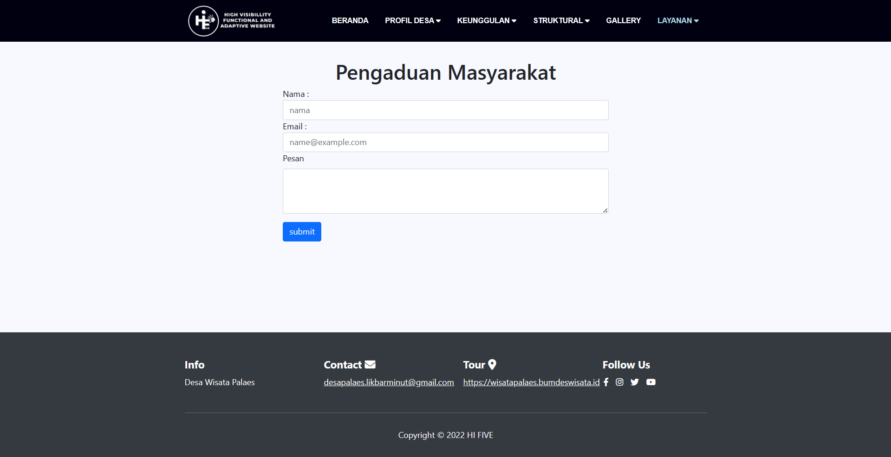

# HI FIVE Website

This is the repository for the HI FIVE website project. HI FIVE is a group project dedicated to creating a website for Desa Wisata Palaes. Through this project, my group mates and I aimed to apply software engineering principles and practices to produce a functional and easy-to-use website for educational purposes.

## Table of Contents

- [About](#about)
- [Features](#features)
- [Technologies Used](#technologies-used)
- [How to Use](#how-to-use)
- [Contributing](#contributing)

## About

This project aims to showcase Desa Wisata Palaes, located in Kecamatan Likupang Barat, Kabupaten Minahasa Utara, Provinsi Sulawesi Utara, Indonesia. The website provides information about the village's history, attractions, local governance, services, and contact details.

## Features

- Overview of Desa Wisata Palaes
- History and profile of the village
- Description of key attractions and points of interest
- Information on local governance and structure
- Contact details for inquiries
- Social media integration

<div style="display:flex;">
    <div style="flex:50%; padding:5px;">
        
    </div>
    <div style="flex:50%; padding:5px;">
        
    </div>
</div>
<div style="display:flex;">
    <div style="flex:50%; padding:5px;">
        
    </div>
    <div style="flex:50%; padding:5px;">
        
    </div>
</div>
<div style="display:flex;">
    <div style="flex:50%; padding:5px;">
        
    </div>
    <div style="flex:50%; padding:5px;">
        
    </div>
</div>
<div style="display:flex;">
    <div style="flex:50%; padding:5px;">
        
    </div>
    <div style="flex:50%; padding:5px;">
        
    </div>
</div>


## Technologies Used

- HTML5
- CSS3
- Bootstrap 5.2.2
- JavaScript
- jQuery 3.6.1
- Font Awesome 6.2.0

## How to Use

To view the website locally, simply download or clone the repository to your local machine and open the `index.html` file in your preferred web browser.

```bash
git clone https://github.com/your-username/HI-FIVE-Website.git
```

## Contributing

Contributions are welcome! If you find any issues or have suggestions for improvements, please open an issue or create a pull request.

1. Fork the repository
2. Create your feature branch (`git checkout -b feature/YourFeature`)
3. Commit your changes (`git commit -am 'Add some feature'`)
4. Push to the branch (`git push origin feature/YourFeature`)
5. Create a new Pull Request

---

© 2022 HI FIVE
